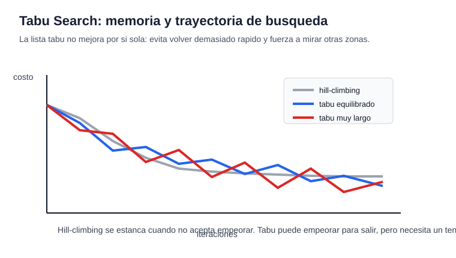

# 02 - Tabu Search

## Primera metaheuristica

Tabu Search es una metaheuristica de una sola solucion. Esto significa que el
algoritmo mantiene una solucion actual y se va moviendo desde ella hacia
soluciones vecinas.

La idea nace desde la busqueda local, pero agrega memoria. Esa memoria evita que
el algoritmo vuelva inmediatamente a decisiones recientes y quede girando sobre
la misma zona del espacio de busqueda.

Como toda metaheuristica, no garantiza encontrar el optimo global. Su objetivo
es encontrar soluciones de buena calidad usando una estrategia mas inteligente
que probar soluciones al azar o quedarse solo con mejoras inmediatas.

## Busqueda local

Para entender Tabu Search, primero hay que entender busqueda local.

Una busqueda local parte desde una solucion inicial y revisa soluciones cercanas,
llamadas vecinas. Si encuentra una vecina mejor, se mueve hacia ella. El problema
es que una busqueda local simple puede quedar atrapada en un optimo local.

Hill-climbing es una version muy simple de esa idea. Su regla es casi siempre:
"si el vecino mejora, me muevo; si no mejora, me quedo". Es facil de entender,
pero justamente por eso es limitado. Cuando llega a una solucion que no tiene
vecinos mejores, se detiene aunque exista una mejor zona mas lejos.

Tabu Search cambia esa regla. No exige moverse siempre a una solucion mejor. En
cada iteracion elige el mejor movimiento admisible, incluso si ese movimiento
empeora temporalmente la solucion actual.

Ese detalle es importante: aceptar un empeoramiento controlado puede permitir
salir de una zona estancada y llegar despues a mejores soluciones.

La memoria tabu no significa recordar todo lo visitado. Significa recordar lo
suficiente para no deshacer inmediatamente los ultimos movimientos. Por eso Tabu
Search puede seguir caminando cuando hill-climbing ya se habria detenido.

## Solucion y vecindario

Una solucion es una configuracion candidata del problema.

En TSP puede ser un orden de ciudades. En mochila puede ser un vector de ceros y
unos. En scheduling puede ser un orden de tareas. La representacion cambia, pero
la logica de Tabu Search se mantiene.

El vecindario es el conjunto de soluciones que se pueden obtener aplicando un
cambio pequeno a la solucion actual.

Ese cambio se llama movimiento. En TSP puede ser invertir un segmento de una
ruta. En mochila puede ser agregar o quitar un objeto. En scheduling puede ser
intercambiar dos tareas.

La calidad del vecindario importa mucho. Si el vecindario es pobre, el algoritmo
explora poco. Si es demasiado grande, cada iteracion puede volverse costosa.

## Lista tabu

La lista tabu es la memoria de corto plazo del algoritmo.

Cuando Tabu Search hace un movimiento, guarda algun atributo de ese movimiento y
lo declara temporalmente prohibido. La idea no es prohibir soluciones para
siempre, sino evitar volver de inmediato al estado anterior.

Por ejemplo, si el algoritmo acaba de invertir cierto segmento de una ruta, puede
marcar ese movimiento como tabu durante algunas iteraciones. Asi se reduce el
riesgo de deshacer el cambio al paso siguiente.

La lista tabu no representa una memoria perfecta de todo lo visitado. Es una
memoria practica, limitada y temporal.

## Tenure

El tenure es la cantidad de iteraciones durante las cuales un movimiento queda
prohibido.

Un tenure muy corto puede permitir ciclos, porque el algoritmo olvida demasiado
rapido. Un tenure muy largo puede bloquear movimientos utiles y alejar demasiado
la busqueda de zonas prometedoras.

Por eso el tenure controla una parte importante del equilibrio entre explotacion
y exploracion. Con memoria corta se explota mas la zona actual. Con memoria mas
larga se fuerza al algoritmo a buscar caminos distintos.

Un tenure razonable no es "el mas grande posible". Si es muy pequeno, la busqueda
puede repetir ciclos. Si es demasiado grande, el algoritmo puede prohibirse a si
mismo movimientos utiles. La memoria sirve para orientar, no para encerrar.

## Aspiracion

El criterio de aspiracion permite romper una prohibicion tabu cuando el
movimiento produce una solucion especialmente buena.

La regla mas comun es permitir un movimiento tabu si mejora la mejor solucion
encontrada hasta el momento.

Esto evita que la memoria sea demasiado rigida. La lista tabu sirve para evitar
ciclos, pero no deberia impedir una mejora clara.

## Estructura en Python

La forma tecnica de implementar Tabu Search es separar el algoritmo del problema.
El algoritmo no necesita saber si trabaja con rutas, mochila o tareas; necesita
recibir funciones que describan como moverse y como evaluar.

En el notebook, la estructura se implementa con estas piezas:

- `initial`: solucion inicial.
- `neighborhood(solution)`: genera movimientos y soluciones vecinas.
- `objective(solution)`: mide la calidad de una solucion.
- `tenure`: duracion de la memoria tabu.
- `iterations`: numero maximo de iteraciones.
- `sense`: indica si el problema es de minimizacion o maximizacion.

Esta separacion permite estudiar Tabu Search como una metaheuristica general. El
metodo se mantiene; lo que cambia es la forma de representar soluciones y de
construir el vecindario.

## Lectura del codigo

El codigo implementa un motor general de Tabu Search.

La clase `TabuSearchResult` ordena la salida del algoritmo. Guarda la mejor
solucion encontrada, su valor objetivo, el historial de mejora y algunas
estadisticas de la busqueda.

La funcion `tabu_search` recibe una solucion inicial, una funcion que genera
vecinos y una funcion objetivo. Con eso puede trabajar sobre distintos problemas
sin cambiar la estructura del algoritmo.

La variable `current` representa la solucion actual. La variable `best_solution`
representa la mejor solucion encontrada hasta el momento.

La estructura `tabu_until` funciona como lista tabu. Para cada movimiento guarda
hasta que iteracion ese movimiento sigue prohibido.

En cada iteracion el algoritmo revisa los vecinos de la solucion actual. Si un
movimiento es tabu, se descarta, salvo que cumpla el criterio de aspiracion y
mejore la mejor solucion global.

Luego se elige el mejor candidato admisible. Ese movimiento se acepta aunque sea
peor que la solucion actual, porque Tabu Search no es una busqueda greedy pura.
Esa aceptacion de empeoramientos controlados es una de las razones por las que
puede escapar de optimos locales.

Al final de cada iteracion se actualiza la memoria tabu, se revisa si hay un
nuevo incumbente y se guarda el historial de la mejor solucion.

## Ejemplo 1 - TSP

En TSP, una solucion es un orden de ciudades. El vecindario se construye con movimientos 2-opt: se invierte un segmento de la ruta para generar una ruta vecina.

Tabu Search guarda el movimiento realizado, por ejemplo el segmento invertido, para evitar deshacerlo inmediatamente.

## Lectura del ejemplo TSP

El objetivo es minimizar la distancia del tour. En cada iteracion se revisan rutas vecinas y se elige la mejor admisible.

Si la mejor ruta admisible es peor que la actual, igual puede aceptarse. Esto es lo que permite salir de optimos locales.

## Ejemplo 2 - Scheduling

Scheduling es un caso donde Tabu Search suele ser util porque pequenas permutaciones del orden de tareas pueden cambiar mucho el resultado.

Aqui se usa una maquina unica con trabajos que tienen tiempo de procesamiento, fecha de entrega y peso de atraso. La solucion es un orden de trabajos y el objetivo es minimizar la tardanza ponderada total.

## Lectura del ejemplo Scheduling

El vecindario se construye intercambiando dos trabajos del orden actual. El movimiento tabu es el par de posiciones intercambiadas.

Este ejemplo es bueno para Tabu porque el algoritmo puede aceptar un orden temporalmente peor para escapar de una secuencia localmente buena, pero globalmente limitada.

## Parametros

Los parametros principales son el tenure, el numero de iteraciones y el
vecindario.

El tenure define cuanta memoria tiene el algoritmo. Las iteraciones definen el
presupuesto de busqueda. El vecindario define que movimientos son posibles desde
cada solucion.

En la practica, estos parametros afectan mucho el resultado. Tabu Search no es
solo "ejecutar un algoritmo"; tambien implica decidir que movimientos tienen
sentido para el problema.

## Complejidad

El costo por iteracion depende principalmente del tamano del vecindario y del
costo de evaluar cada vecino.

Si en cada iteracion se revisan muchos vecinos, el metodo puede volverse caro.
Por eso en problemas grandes a veces se evalua solo una parte del vecindario o
se usan estructuras para calcular cambios de costo mas rapido.

La complejidad total depende del numero de iteraciones multiplicado por el
trabajo necesario para evaluar los candidatos.

## Cuando se usa

Tabu Search se usa en problemas donde una busqueda local simple se queda
atrapada facilmente, pero donde es posible definir movimientos razonables entre
soluciones.

Es comun en rutas, asignacion, scheduling, seleccion de subconjuntos y otros
problemas combinatorios.

Funciona bien cuando se puede construir un buen vecindario y cuando la memoria
tabu ayuda a evitar ciclos sin bloquear demasiado la busqueda.

## Resumen

Tabu Search es una metaheuristica de una sola solucion basada en busqueda local
con memoria.

Su idea central es moverse al mejor vecino admisible, aunque no siempre mejore la
solucion actual, y usar una lista tabu para evitar volver inmediatamente sobre
movimientos recientes.

No garantiza el optimo global, pero puede escapar de optimos locales mejor que
una busqueda local greedy. Su rendimiento depende del vecindario, el tenure, el
criterio de aspiracion y el numero de iteraciones.

