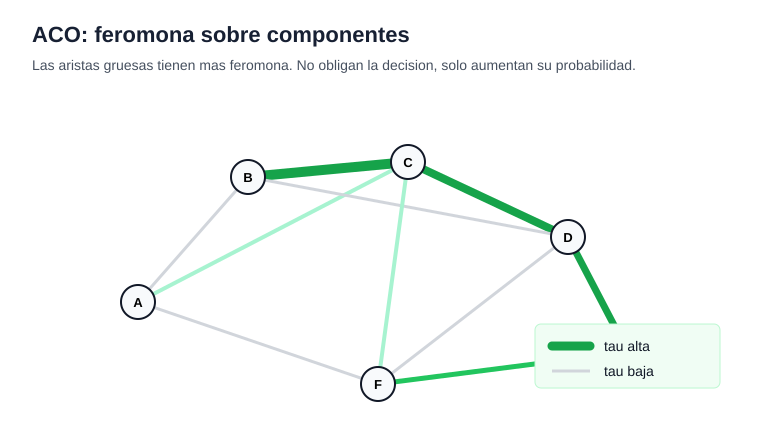

# 03 - Ant Colony Optimization

## Idea general

Ant Colony Optimization, o ACO, es una metaheuristica poblacional inspirada en el
comportamiento de colonias de hormigas.

La idea no es copiar literalmente a las hormigas, sino usar una analogia util:
varios agentes construyen soluciones, dejan informacion sobre las partes que
usaron y esa informacion influye en las soluciones futuras.

En ACO, esa informacion se llama feromona. Las partes de una solucion que han
aparecido en buenas soluciones reciben mas feromona y se vuelven mas atractivas
para las siguientes hormigas.

Como metaheuristica, ACO no garantiza encontrar el optimo global. Su objetivo es
guiar la busqueda combinando experiencia acumulada y decisiones probabilisticas.

## Soluciones constructivas

ACO funciona especialmente bien en problemas donde una solucion se puede
construir paso a paso.

En rutas, una hormiga puede construir un tour eligiendo la siguiente ciudad. En
un camino sobre un grafo, puede elegir el siguiente arco. En asignacion, puede
ir asignando elementos a posiciones o recursos.

La idea tecnica es que una solucion completa esta formada por componentes.

Un componente puede ser una arista, una ciudad elegida, una asignacion parcial o
una decision que se agrega a la solucion.

ACO no parte necesariamente con una solucion completa y la modifica, como Tabu
Search. En cambio, muchas hormigas construyen soluciones desde cero o desde un
estado inicial.

## Feromona

La feromona representa memoria colectiva.

Si cierto componente aparece muchas veces en buenas soluciones, su nivel de
feromona aumenta. Luego, cuando una nueva hormiga debe elegir entre varios
componentes posibles, los componentes con mas feromona tienen mayor probabilidad
de ser elegidos.

Esta memoria no pertenece a una hormiga individual. Pertenece al sistema
completo. Por eso ACO se considera una metaheuristica poblacional o de colonia.

La feromona permite explotacion: aprovechar informacion aprendida de soluciones
anteriores.

## Heuristica local

Ademas de la feromona, ACO suele usar informacion heuristica del problema.

La heuristica local mide que tan atractivo parece un componente antes de conocer
toda la solucion. En TSP, por ejemplo, una ciudad cercana puede ser mas atractiva
que una ciudad lejana.

La feromona mira la experiencia acumulada. La heuristica mira una conveniencia
local inmediata.

La decision de una hormiga combina ambas fuentes de informacion. Por eso ACO no
es puramente greedy ni puramente aleatorio.

## Regla probabilistica

Cuando una hormiga debe elegir el siguiente componente, no siempre toma el mejor
de forma deterministica.

Cada componente recibe un peso segun su feromona y su heuristica. Luego la
hormiga elige probabilisticamente: los componentes con mayor peso tienen mayor
probabilidad, pero otros componentes todavia pueden ser elegidos.

El parametro `alpha` controla cuanto pesa la feromona. Si es alto, la colonia
sigue mas fuerte lo que ya aprendio.

El parametro `beta` controla cuanto pesa la heuristica local. Si es alto, las
hormigas se comportan de forma mas greedy.

Esta regla es importante porque mantiene un equilibrio. La colonia aprovecha
informacion acumulada, pero conserva exploracion al no elegir siempre lo mismo.

Una forma compacta de leer la regla es esta:

`peso(componente) = feromona^alpha * heuristica^beta`

Despues esos pesos se transforman en probabilidades. Si un componente tiene mas
feromona o mejor heuristica, tiene mas opcion de ser elegido, pero no queda
garantizado. Esa incertidumbre es parte de la exploracion.

En un grafo, la feromona suele vivir sobre aristas. Una arista gruesa en el
grafico significa que fue reforzada por buenas soluciones anteriores. Aun asi,
una hormiga podria elegir otra arista si la probabilidad lo permite.

## Evaporacion

La evaporacion reduce la feromona con el tiempo.

Sin evaporacion, las primeras buenas decisiones podrian dominar para siempre,
incluso si no eran realmente las mejores. La evaporacion permite olvidar parte
de la informacion antigua y seguir explorando.

El parametro `rho` controla la tasa de evaporacion. Si `rho` es alto, la memoria
se pierde mas rapido. Si es bajo, la colonia conserva mas fuerte la informacion
acumulada.

La evaporacion es una parte central del metodo porque evita la convergencia
prematura.

## Deposito

Despues de construir soluciones, las hormigas depositan feromona sobre los
componentes que usaron.

La cantidad depositada depende de la calidad de la solucion. En minimizacion, una
solucion de menor costo suele depositar mas feromona. En maximizacion, una
solucion de mayor valor deberia depositar mas.

Asi la colonia refuerza patrones utiles sin imponerlos de manera absoluta.

La combinacion de deposito y evaporacion crea una memoria dinamica: se premian
buenas decisiones, pero tambien se permite que la informacion cambie.

## Estructura en Python

La forma tecnica de implementar ACO de manera general es separar el motor de la
colonia del problema especifico.

En el notebook, la estructura se implementa con estas piezas:

- `initial_state`: crea el estado inicial de una hormiga.
- `available_components(state)`: entrega los componentes que una hormiga puede
  elegir desde ese estado.
- `add_component(state, component)`: agrega una decision y produce un nuevo
  estado.
- `solution_from_state(state)`: transforma el estado final en una solucion.
- `objective(solution)`: mide la calidad de la solucion.
- `components_of(solution)`: indica que componentes reciben feromona.
- `heuristic(state, component)`: mide la conveniencia local de un componente.
- `pheromone_key(state, component)`: identifica donde se guarda la feromona.

Esta separacion hace que ACO no dependa de TSP. Lo importante es que el problema
permita construir soluciones por componentes.

## Lectura del codigo

El codigo implementa un motor general de Ant Colony Optimization.

La clase `AntColonyResult` ordena la salida del algoritmo: mejor solucion,
mejor valor, historial de mejora, feromonas finales e iteraciones realizadas.

La funcion `ant_colony_optimization` recibe funciones del problema. Con ellas
puede construir soluciones sin saber si los componentes son ciudades, aristas,
tareas o asignaciones.

La variable `pheromone` guarda la memoria colectiva. Cada clave representa un
componente o decision, y su valor indica cuanta feromona tiene.

En cada iteracion se generan varias hormigas. Cada hormiga parte desde un estado
inicial y va agregando componentes mientras existan decisiones disponibles.

Para elegir un componente, el codigo calcula un peso combinando feromona y
heuristica. Luego usa una eleccion aleatoria ponderada. Esto significa que el
mejor componente no siempre se elige, pero tiene mas probabilidad.

Cuando todas las hormigas construyen sus soluciones, el algoritmo evalua la
funcion objetivo y actualiza la mejor solucion encontrada.

Despues ocurre la evaporacion: todas las feromonas conocidas se reducen. Luego
viene el deposito: las soluciones construidas refuerzan los componentes que
usaron, segun su calidad.

La idea importante es que la colonia aprende sin que exista una hormiga central.
El aprendizaje queda guardado en la feromona compartida.

## Ejemplo 1 - TSP

TSP es un ejemplo natural para ACO porque una ruta se construye ciudad por ciudad.

El estado es la ruta parcial, el componente es la siguiente ciudad y la feromona se asocia a la arista usada para avanzar desde una ciudad a otra.

## Lectura del ejemplo TSP

Cada hormiga empieza en una ciudad fija y agrega ciudades no visitadas. Para elegir la siguiente ciudad combina feromona acumulada y una heuristica local basada en distancia.

Despues de construir los tours, las aristas usadas por mejores rutas reciben mas feromona. La evaporacion evita que una arista domine demasiado pronto.

## Ejemplo 2 - Camino mas corto

El camino mas corto en un grafo es especialmente natural para ACO, porque las hormigas pueden caminar desde un origen hasta un destino eligiendo aristas.

La feromona se deposita sobre aristas que aparecen en caminos construidos. Los caminos mas cortos depositan mas feromona.

## Lectura del ejemplo Camino mas corto

El estado es el camino parcial. Los componentes disponibles son los vecinos no visitados del ultimo nodo.

Este ejemplo muestra la intuicion original de ACO: muchas hormigas prueban caminos, los caminos buenos se refuerzan y la evaporacion mantiene abierta la exploracion.

## Parametros

Los parametros mas importantes son `alpha`, `beta`, `rho`, el numero de hormigas
y el numero de iteraciones.

`alpha` controla la influencia de la feromona. `beta` controla la influencia de
la heuristica local. `rho` controla cuanto se olvida en cada evaporacion.

Muchas hormigas entregan mas exploracion por iteracion, pero tambien aumentan el
costo computacional. Muchas iteraciones permiten mas aprendizaje, pero tambien
pueden producir estancamiento si la feromona se concentra demasiado.

Lectura rapida de parametros:

- `alpha` alto: la colonia confia mas en la memoria acumulada.
- `beta` alto: la colonia se vuelve mas greedy con la informacion local.
- `rho` alto: se olvida mas rapido por evaporacion.
- muchas hormigas: mas soluciones por iteracion, pero mayor costo.
- muchas iteraciones: mas aprendizaje, pero mas riesgo de estancamiento si no
  hay suficiente exploracion.

## Complejidad

El costo depende de cuantas hormigas se usan, cuantos pasos necesita cada
solucion y cuantos componentes candidatos se revisan en cada paso.

En problemas de rutas, una regla aproximada es que cada iteracion puede ser
costosa porque cada hormiga construye una solucion completa y en cada decision
debe comparar candidatos.

Por eso ACO puede ser mas caro que una busqueda local simple, pero a cambio
explora muchas soluciones en paralelo y acumula aprendizaje colectivo.

## Cuando se usa

ACO se usa especialmente en problemas combinatorios constructivos.

Es natural en rutas, caminos en grafos, redes, secuenciacion y asignacion,
siempre que tenga sentido construir una solucion eligiendo componentes paso a
paso.

Funciona bien cuando hay informacion local util y cuando reforzar componentes de
buenas soluciones ayuda a guiar busquedas futuras.

## Resumen

Ant Colony Optimization es una metaheuristica poblacional donde muchas hormigas
construyen soluciones usando feromona e informacion heuristica.

La feromona representa memoria colectiva. La heuristica representa conveniencia
local. La evaporacion evita que la colonia se quede pegada demasiado pronto.

Su fortaleza es que combina exploracion probabilistica con aprendizaje
colectivo. Su debilidad es que depende bastante de parametros y puede estancarse
si la feromona se concentra demasiado rapido.

